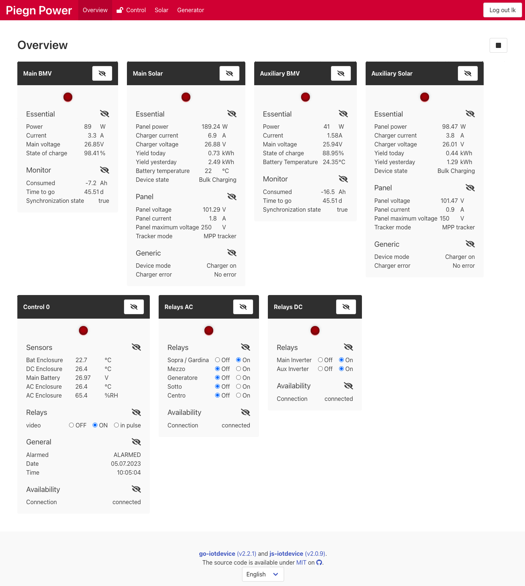

 go-iotdevice
[](https://github.com/koestler/js-iotsensor/actions/workflows/docker-image.yml)

This tool reads values from various IoT devices like solar charges directly connected by USB
or relay boards connected by ethernet and publishes those on [MQTT](http://mqtt.org/) servers.

Additionally, a REST- and websocket-API and a [web frontend](https://github.com/koestler/js-iotdevice)
is made available via an internal http server.



The tool does not store any historical data. Instead,
[go-mqtt-to-influx](https://github.com/koestler/go-mqtt-to-influx) is used to write this data
to an [Influx Database](https://github.com/influxdata/influxdb) from where it is displayed
on a [Grafana](https://grafana.com/) dashboard.

The tool was written with the following two scenarios in mind:
* An off-grid holiday home installation running two batteries with
  Victron Energy [SmartSolar](https://www.victronenergy.com/solar-charge-controllers/bluesolar-mppt-150-35) / 
  [SmartShunt](https://www.victronenergy.com/battery-monitors/smart-battery-shunt) for solar and battery monitoring, 
 a [Shelly 3EM](https://www.shelly.cloud/en-ch/products/product-overview/shelly-3-em) for generator power monitoring.
 The tool runs on a single [Raspberry Pi Zero 2 W](https://www.raspberrypi.com/products/raspberry-pi-zero-2-w/).
* Remote control of a generator set using a [Teracom TCW241](https://www.teracomsystems.com/ethernet/ethernet-io-module-tcw241/)
  for start / stop and temperature monitoring. Control is integrated into [Homea Assistant](https://www.home-assistant.io/)
  via MQTT.

## Supported protocols and devices

The tool currently implements the following devices which are all used in an active project of mine.
However, it is made to be extended. Feel free to send pull requests or 
[create an issue](https://github.com/koestler/go-iotdevice/issues).

The following protocols are supported:
* [Victron Energy](https://www.victronenergy.com/) [VE.Direct](https://www.victronenergy.com/live/vedirect_protocol:faq)
* HTTP GET json / xml files
* MQTT
* Modbus

The following devices are supported:
* via a VE.Direct:
  * Victron Energy [BlueSolar MPPT](https://www.victronenergy.com/solar-charge-controllers/mppt7510)
  * Victron Energy [SmartSolar MPPT](https://www.victronenergy.com/solar-charge-controllers/smartsolar-150-35)
  * Victron Energy Battery Monitor [BMV 700](https://www.victronenergy.com/battery-monitors/bmv-700),
      [BMV 702](https://www.victronenergy.com/battery-monitors/bmv-702),
      [BMV-712 Smart](https://www.victronenergy.com/battery-monitors/bmv-712-smart)
  * Victron Energy [SmartShunt](https://www.victronenergy.com/battery-monitors/smart-battery-shunt)
  * Victron Energy [Phoenix Inverter](https://www.victronenergy.com/inverters)
* via HTTP:
  * [Shelly 3EM](https://www.shelly.cloud/en-ch/products/product-overview/shelly-3-em) 3 phase energy power monitor
  * [Teracom TCW241](https://www.teracomsystems.com/ethernet/ethernet-io-module-tcw241/) industrial relay / sensor board
* via MQTT:
  * Another go-iotdevice instance connected to the same MQTT broker. This allows to connect devices
    to different linux machines at different location but still having one single frontend showing all devices.
* via Modbus
  * [Waveshare Industrial Modbus RTU 8-ch Relay Module](https://www.waveshare.com/modbus-rtu-relay.htm), a cheap relay board with programmable address (up to 255 on one bus)

## Configuration
The tool supports command line options to for profiling. See:
```bash
./go-iotdevice --help
Usage:
  go-iotdevice [-c <path to yaml config file>]

Application Options:
      --version     Print the build version and timestamp
  -c, --config=     Config File in yaml format (default: ./config.yaml)
      --cpuprofile= write cpu profile to <file>
      --memprofile= write memory profile to <file>

Help Options:
  -h, --help        Show this help message
```

All other configuration defined in a single yaml file which is read from `./config.yaml` by default.

Here is a fully documented configuration file including all options:
```yaml
# documentation/full-config.yaml

Version: 1                                                 # configuration file format; must be set to 1 for >v2 of this tool.
ProjectTitle: Configurable Title of Project                # optional, default go-iotdevice: is shown in the http frontend
LogConfig: true                                            # optional, default true, outputs the used configuration including defaults on startup
LogWorkerStart: true                                       # optional, default true, outputs what devices and mqtt clients are started
LogStorageDebug: false                                     # optional, default false, outputs all write to the internal value storage

HttpServer:                                                # optional, when missing: http server is not started
  Bind: "[::1]"                                            # mandatory, use [::1] (ipv6 loopback) to enable on both ipv4 and 6 and 0.0.0.0 to only enable ipv4
  Port: 8000                                               # optional, default 8000
  LogRequests: true                                        # optional, default true, enables the http access log to stdout
  # configure FrontendProxy xor FrontendPath
  #FrontendProxy: "http://127.0.0.1:3000/"                 # optional, default deactivated; proxies the frontend to another server; useful for development
  FrontendPath: ./frontend-build/                          # optional, default "./frontend-build/": path to a static frontend build
  FrontendExpires: 5m                                      # optional, default 5min, what cache-control header to send for static frontend files
  ConfigExpires: 1m                                        # optional, default 1min, what cache-control header to send for configuration endpoints
  LogDebug: false                                          # optional, default false, output debug messages related to the http server

Authentication:                                            # optional, when missing: login is disabled
  #JwtSecret: 'insert a random string here and uncomment'  # optional, default new random string on startup, used to sign the JWT tokens
                                                           # when configured, the users do not get logged out on restart
  JwtValidityPeriod: 1h                                    # optional, default 1h, users are logged out after this time
  HtaccessFile: ./auth.passwd                              # mandatory, where the file generated by htpasswd can be found

MqttClients:                                               # optional, when empty, no mqtt connection is made
  local:                                                   # mandatory, an arbitrary name used for logging and for referencing in other config sections
    Broker: tcp://mqtt.example.com:1883                    # mandatory, the URL to the server, use tcp:// or ssl://
    ProtocolVersion: 5                                     # optional, default 5, must be 5 always, only mqtt protocol version 5 is supported

    User: dev                                              # optional, default empty, the user used for authentication
    Password: zee4AhRi                                     # optional, default empty, the password used for authentication
    #ClientId: go-iotdevice                                # optional, default go-iotdevice-UUID, mqtt client id, make sure it is unique per mqtt-server

    Qos: 1                                                 # optional, default 1, what quality-of-service level shall be used for published messages and subscriptions
    KeepAlive: 1m                                          # optional, default 60s, how often a ping is sent to keep the connection alive
    ConnectRetryDelay: 10s                                 # optional, default 10s, when disconnected: after what delay shall a connection attempt is made
    ConnectTimeout: 5s                                     # optional, default 5s, how long to wait for the SYN+ACK packet, increase on slow networks
    TopicPrefix: go-iotdevice/                             # optional, %Prefix% is replaced with this string
    ReadOnly: false                                        # optional, default false, when true, no messages are sent to the server (overriding MaxBacklogSize, AvailabilityEnable, StructureEnable, TelemetryEnable, RealtimeEnable)
    MaxBacklogSize: 256                                    # optional, default 256, max number of mqtt messages to store when connection is offline

    AvailabilityClientEnable: true                         # optional, default true, whether to send online messages and register an offline message as will
    AvailabilityClientTopicTemplate: '%Prefix%avail/%ClientId%' # optional, what topic to use for online/offline messages of the go-iotdevice instance
    AvailabilityClientRetain: true                         # optional, default true, the mqtt retain flag for availability messages

    AvailabilityDeviceEnable: true                         # optional, default true, whether to send online messages and register an offline message as will
    AvailabilityDeviceTopicTemplate: '%Prefix%avail/%DeviceName%'# optional, what topic to use for online/offline messages of a specific device
    AvailabilityDeviceRetain: true                         # optional, default true, the mqtt retain flag for availability messages

    StructureEnable: true                                  # optional, default true, whether to send messages containing the list of registers / types
    StructureTopicTemplate: '%Prefix%struct/%DeviceName%' # optional, what topic to use for structure messages
    StructureInterval: 0s                                  # optional, default 0, 0 means disabled only send initially, otherwise the structure is repeated after this interval (useful when retain is false)
    StructureRetain: true                                  # optional, default true, the mqtt retain flag for structure messages

    TelemetryEnable: true                                  # optional, default true, whether to send telemetry messages (one per device)
    TelemetryTopicTemplate: '%Prefix%tele/%DeviceName%'    # optional, what topic to use for telemetry messages
    TelemetryInterval: 10s                                 # optional, default 10s, how often to sent telemetry mqtt messages
    TelemetryRetain: false                                 # optional, default false, the mqtt retain flag for telemetry messages

    RealtimeEnable: true                                   # optional, default false, whether to enable sending realtime messages
    RealtimeTopicTemplate: '%Prefix%real/%DeviceName%/%RegisterName%' # optional, what topic to use for realtime messages
    RealtimeInterval: 0s                                   # optional, default 0; 0 means send immediately when a value changes, otherwise only changed values are sent once per interval
    RealtimeRepeat: false                                  # optional, default false, when true and RealtimeInterval > 0, then all messages are always sent. When false, only changed values are sent.
    RealtimeRetain: false                                  # optional, default false, the mqtt retain flag for realtime messages

    LogDebug: false                                        # optional, default false, very verbose debug log of the mqtt connection
    LogMessages: false                                     # optional, default false, log all incoming mqtt messages

Modbus:                                                    # optional, when empty, no modbus handler is started
  bus0:                                                    # mandatory, an arbitrary name used for logging and for referencing in other config sections
    Device: /dev/ttyACM0                                   # mandatory, the RS485 serial device
    BaudRate: 4800                                         # mandatory, eg. 9600
    ReadTimeout: 100ms                                     # optional, default 100ms, how long to wait for a response
    LogDebug: false                                        # optional, default false, verbose debug log

VictronDevices:                                            # optional, a list of Victron Energy devices to connect to
  bmv0:                                                    # mandatory, an arbitrary name used for logging and for referencing in other config sections
    General:                                               # optional, this section is exactly the same for all devices
      SkipFields:                                          # optional, default empty, a list of field names that shall be ignored for this device
        - Temperature                                      # for BMV devices without a temperature sensor connect
        - AuxVoltage                                       # for BMV devices without a mid- or starter-voltage reading
      SkipCategories:                                      # optional, default empty, a list of category names that shall be ignored for this device
        - Settings                                         # for solar devices it might make sense to not fetch / output the settings
      TelemetryViaMqttClients:                             # optional, default all non-readonly clients, to what mqtt servers shall telemetry messages be sent to
        - local                                            # state the arbitrary name of the mqtt client as defined in the MqttClients section of this file
      RealtimeViaMqttClients:                              # optional, default all non-readonly clients, to what mqtt servers shall realtime messages be sent to
        - local
      RestartInterval: 200ms                               # optional, default 200ms, how fast to restart the device if it fails / disconnects
      RestartIntervalMaxBackoff: 1m                        # optional, default 1m; when it fails, the restart interval is exponentially increased up to this maximum
      LogDebug: false                                      # optional, default false, enable debug log output
      LogComDebug: false                                   # optional, default false, enable a verbose log of the communication with the device
    Device: /dev/serial/by-id/usb-VictronEnergy_BV_VE_Direct_cable_VEHTVQT-if00-port0 # mandatory except if Kind: Random*, the path to the usb-to-serial converter
    Kind: Vedirect                                         # mandatory, possibilities: Vedirect, RandomBmv, RandomSolar, always set to Vedirect expect for development

ModbusDevices:                                             # optional, a list of devices connected via ModBus
  modbus-rtu0:                                             # mandatory, an arbitrary name used for logging and for referencing in other config sections
    General:                                               # optional, this section is exactly the same for all devices
      SkipFields:                                          # optional, default empty, a list of field names that shall be ignored for this device
      SkipCategories:                                      # optional, default empty, a list of category names that shall be ignored for this device
      TelemetryViaMqttClients:                             # optional, default all clients, to what mqtt servers shall telemetry messages be sent to
      RealtimeViaMqttClients:                              # optional, default all clients, to what mqtt servers shall realtime messages be sent to
      RestartInterval: 200ms                               # optional, default 200ms, how fast to restart the device if it fails / disconnects
      RestartIntervalMaxBackoff: 1m                        # optional, default 1m; when it fails, the restart interval is exponentially increased up to this maximum
      LogDebug: false                                      # optional, default false, enable debug log output
      LogComDebug: false                                   # optional, default false, enable a verbose log of the communication with the device
    Bus: bus0                                              # mandatory, the identifier of the modbus to use
    Kind: WaveshareRtuRelay8                               # mandatory, type/model of the device; possibilities: WaveshareRtuRelay8
    Address: 0x01                                          # mandatory, the modbus address of the device in hex as a string, e.g. 0x0A
    Relays:                                                # optional: a map of custom labels for the relays
      CH1:
        Description: Lamp                                  # optional: show the CH1 relay as "Lamp" in the frontend
        OpenLabel: Off                                     # optional, default "open", a label for the open state
        ClosedLabel: On                                    # optional, default "closed", a label for the closed state
    PollInterval: 1s                                       # optional, default 1s, how often to fetch the device status

HttpDevices:                                               # optional, a list of devices controlled via http
  tcw241:                                                  # mandatory, an arbitrary name used for logging and for referencing in other config sections
    General:                                               # optional, this section is exactly the same for all devices
      SkipFields:                                          # optional, default empty, a list of field names that shall be ignored for this device
      SkipCategories:                                      # optional, default empty, a list of category names that shall be ignored for this device
      TelemetryViaMqttClients:                             # optional, default all clients, to what mqtt servers shall telemetry messages be sent to
      RealtimeViaMqttClients:                              # optional, default all clients, to what mqtt servers shall realtime messages be sent to
      RestartInterval: 200ms                               # optional, default 200ms, how fast to restart the device if it fails / disconnects
      RestartIntervalMaxBackoff: 1m                        # optional, default 1m; when it fails, the restart interval is exponentially increased up to this maximum
      LogDebug: false                                      # optional, default false, enable debug log output
      LogComDebug: false                                   # optional, default false, enable a verbose log of the communication with the device
    Url: http://control0/                                  # mandatory, URL to the device; supported protocol is http/https; e.g. http://device0.local/
    Kind: Teracom                                          # mandatory, type/model of the device; possibilities: Teracom, Shelly3m
    Username: admin                                        # optional, username used to log in
    Password: my-secret                                    # optional, password used to log in
    PollInterval: 1s                                       # optional, default 1s, how often to fetch the device status

MqttDevices:                                               # optional, a list of devices receiving its values via a mqtt server from another instance
  bmv1:                                                    # mandatory, an arbitrary name used for logging and for referencing in other config sections
    General:                                               # optional, this section is exactly the same for all devices
      SkipFields:                                          # optional, default empty, a list of field names that shall be ignored for this device
      SkipCategories:                                      # optional, default empty, a list of category names that shall be ignored for this device
      TelemetryViaMqttClients:                             # optional, default all clients, to what mqtt servers shall telemetry messages be sent to
      RealtimeViaMqttClients:                              # optional, default all clients, to what mqtt servers shall realtime messages be sent to
      RestartInterval: 200ms                               # optional, default 200ms, how fast to restart the device if it fails / disconnects
      RestartIntervalMaxBackoff: 1m                        # optional, default 1m; when it fails, the restart interval is exponentially increased up to this maximum
      LogDebug: false                                      # optional, default false, enable debug log output
      LogComDebug: false                                   # optional, default false, enable a verbose log of the communication with the device
    MqttTopics:                                            # mandatory, at least 1 topic must be defined
      - stat/go-iotdevice/bmv1/+                           # what topic to subscribe to; must match RealtimeTopic of the sending device; %RegisterName% must be replaced by +
    MqttClients:                                           # optional, default all clients, on which mqtt server(s) we subscribe
      - local                                              # identifier as defined in the MqttClients section

Views:                                                     # optional, a list of views (=categories in the frontend / paths in the api URLs)
  - Name: victron                                          # mandatory, a technical name used in the URLs
    Title: Victron                                         # mandatory, a nice title displayed in the frontend
    Devices:                                               # mandatory, a list of devices using
      - Name: bmv0                                         # mandatory, the arbitrary names defined above
        Title: Battery Monitor                             # mandatory, a nice title displayed in the frontend
        SkipFields:                                        # optional, default empty, field names that are omitted when displaying this view
        SkipCategories:                                    # optional, default empty, category names that are omitted when displaying this view
      - Name: modbus-rtu0                                  # mandatory, the arbitrary names defined above
        Title: Relay Board                                 # mandatory, a nice title displayed in the frontend
    Autoplay: true                                         # optional, default true, when true, live updates are enabled automatically when the view is open in the frontend
    AllowedUsers:                                          # optional, if empty, all users of the HtaccessFile are considered valid, otherwise only those listed here
      - test0                                              # username which is allowed to access this view
    Hidden: false                                          # optional, default false, if true, this view is not shown in the menu unless the user is logged in

HassDiscovery:                                             # optional, default, empty, defines which registers should be advertised via the homeassistant discovery mechanism
                                                           # the implementation of the hass discovery service and this configuration section is going to change in the next major version.
  # You can have multiple sections to advertise on different topics, on different MqttServers of matching different registers
  # each register is only advertised once per server / topic even if multiple entries match
  - TopicPrefix:                                           # optional, default 'homeassistant', the mqtt topic used for the discovery messages
    ViaMattClients:                                        # optional, default all clients, on what mqtt servers shall the registers by advertised
    Devices:                                               # mandatory, a list of devices defined in this file to make discoverable
      - bmv1                                               # use device identifiers of the VictronDevices, ModbusDevices etc. sections
    Categories:                                            # optional, default all, a list of regular expressions against which devices names are matched (eg. "device1" or user ".*" for all devices)
      - .*                                                 # match all categories; see the category field in /api/v2/views/dev/devices/DEVICE-NAME/registers
    Registers:                                             # optional, default all, a list of regular expressions against which register names are matched
      - Voltage$                                           # matches all registers with a name ending in Voltage, eg. MainVoltage, AuxVoltage
      - ˆBattery                                           # matches all registers with a name begining with Battery, eg. BatteryTemperature
```

## Authentication
The tool can use [JWT](https://jwt.io/) to make certain views only available after a login. The user database
is stored in an apache htaccess file which can be changed without restarting the server. 

### Configuration

There are two relevant section in the configuration file:

1. Adding the `Authentication:` section enables the login / authentication mechanism.
The `JwtSecret` is used to sign the tokens. When left unconfigured, a new random secret is generated on each
startup of the backend. This results in all users being logged out after each restart of the server.
It's therefore best to hardcode a random secret.

2. Per `View` you can define a list of `AllowedUsers`. When the list is present and has at lest one entry, only
usernames on that list can access this view. If the list is empty, all users in the user database can access. 


### User database
The only supported authentication backend at the moment is a simple apache htaccess file. Set it up as follows:

```bash
htpasswd -c auth.passwd lorenz
# enter password twice
htpasswd auth.passwd daniela
# enter another password twice
```

## Nginx reverse proxy
I normally run this service behind one or even two nginx server configured as a reverse proxy. It can take care of:
 * Serving multiple different applications on the same address using [SNI](https://en.wikipedia.org/wiki/Server_Name_Indication).
 * Caching on a fast cloud server in front of a device connected via a slow mobile connection.
 * https termination

### Setup
It's assumed that you understand each of the following steps in details. It's just to make the setup steps as quick as possible. 

```bash
# install nginx / curl
apt update && apt install -y nginx curl

# define on what URL the tool shall be reachable
SITE=foo.example.com
CONFFILE=$SITE".conf"

# create nginx configuration
cd /etc/nginx/sites-available/
curl https://raw.githubusercontent.com/koestler/go-iotdevice/main/documentation/nginx-example.conf -o $CONFFILE
sed -i "s/example.com/$SITE/g" $CONFFILE
cd ../sites-enabled
ln -s "../sites-available/"$CONFFILE

# edit the proxy_pass directive to the correct address for the service
emacs $CONFFILE 

# setup certbot. use something like this:
mkdir -p /srv/www-acme-challenge/$SITE
certbot certonly --authenticator webroot --webroot-path /srv/www-acme-challenge/$SITE -d $SITE

# reload the nginx config
service nginx reload 
```

## Development

### Run locally
For development this backend can be compiled and run locally.
In addition, it's then best to also und run the [frontend](https://github.com/koestler/js-iotdevice) locally. 
There is a good starting point for a development configuration.

```bash
cp documentation/dev-config.yml config.yml
go build && ./go-iotdevice
```


### Compile and run inside docker
Alternatively, if you don't have golang installed locally, you can compile and run 

```bash
docker build -f docker/Dockerfile -t go-iotdevice .
docker run --rm --name go-iotdevice -p 127.0.0.1:8000:8000 \
  -v "$(pwd)"/documentation/dev-config.yaml:/config.yaml:ro \
  go-iotdevice
```

### run tests
```bash
go install github.com/golang/mock/mockgen@v1.6.0
go genreate ./...
go test ./...
```

### Update README.md
```bash
npx embedme README.md
```
